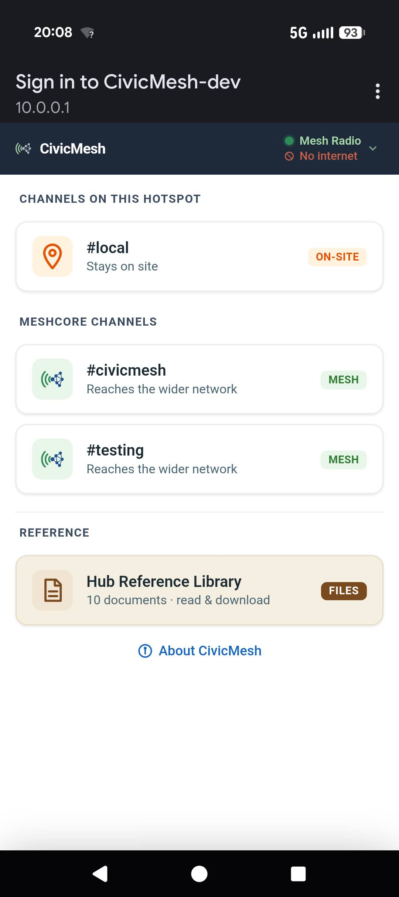
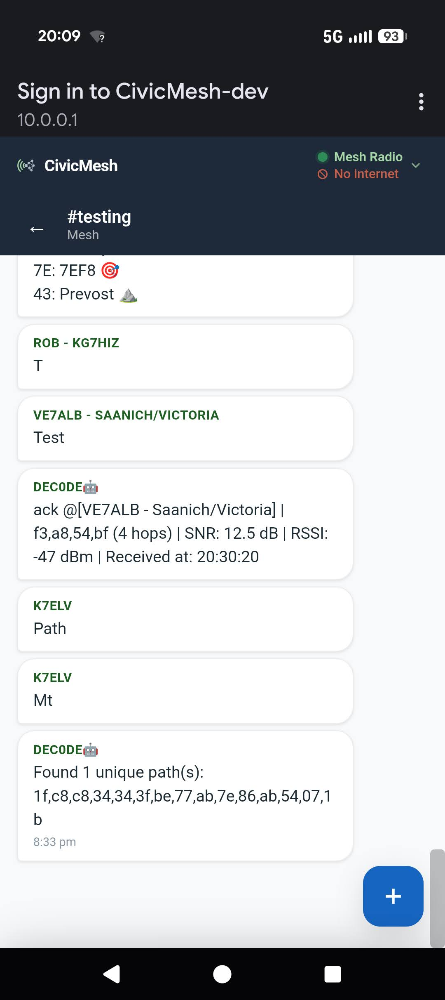
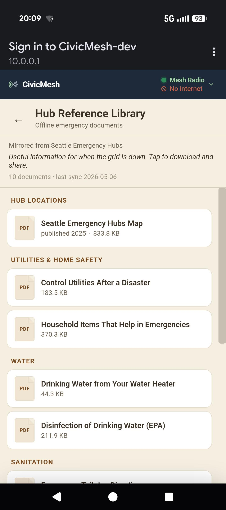

# CivicMesh

**A walk-up MeshCore relay for Seattle Emergency Hubs.**

## What 

CivicMesh is:

- a Raspberry Pi captive portal
- bridged to MeshCore over USB serial
- exposing selected public mesh channels over WiFi
- for walk-up users with ordinary phones
- optimized for Seattle Emergency Hubs and disaster drills

<p align="center">
  
  &nbsp;&nbsp;
  
  &nbsp;&nbsp;
  
</p>

## Why

[Seattle Emergency Hubs](https://seattleemergencyhubs.org/) are
neighborhood gathering points: places people show up after a grid-down
event to share information. Mutual aid is the infrastructure when the
other infrastructure is overwhelmed. CivicMesh is intended for use at a Hub. A
Raspberry Pi and a MeshCore radio together become an offline WiFi access point.
Anyone in range opens the captive portal on their phone and reads or posts to
public mesh channels. No app, no account, no ISP.

CivicMesh acts as a constrained store-and-forward bridge between walk-up WiFi
users and selected public MeshCore channels. Messages are stored locally and
relayed onto the regional mesh network. Even if the radio is down or the mesh
is unreachable, locally-stored messages remain readable to other walk-up users.

Seattle Emergency Hubs already operate structured radio workflows through ACS
operators and information teams. Those channels are bandwidth-constrained and
prioritize high-impact traffic. CivicMesh exists as a parallel low-friction
channel for neighborhood-scale information that would otherwise never enter the
formal net.

## Non-goals

CivicMesh is not:

- encrypted messaging
- anonymous messaging
- direct messaging
- a replacement for ACS or any licensed service
- a high-throughput mesh gateway
- an internet gateway — the WiFi AP has no uplink, by design
- a general-purpose community WiFi ISP
- a resilient social network
- a moderation-heavy platform

## Threat model

Messages are public and observable by anyone on the mesh or local
WiFi. CivicMesh prioritizes accessibility and operability over
confidentiality. Do not enter secrets, do not post anything you
wouldn't write on a public board at the Hub.

The portal is HTTP-only by design — modern phones don't reliably
trust self-signed certs on captive portals, and a public-information
board doesn't need TLS to do its job. Posting and voting require a
session cookie plus MAC-address validation (ARP lookup via
`/proc/net/arp`), so a poster can't trivially impersonate another
walk-up. Rate limits are configurable per-session, and MAC/cookie
mismatches surface in the security log. None of this stops a
determined adversary on the same WiFi from causing harm; it raises
the cost of casual abuse and pins posts to a device when something
goes wrong.

## How it works

MeshCore is an open-source LoRa mesh of small, low-power radios that
relay messages neighbor-to-neighbor, no towers and no internet
required. By 2026 the regional MeshCore network reaches from
Vancouver BC to Portland: the same corridor most exposed to a
Cascadia subduction zone event. CivicMesh plugs into that existing
fabric rather than building its own.

```
Phone browser
   ↕ WiFi, no internet
Raspberry Pi  (captive portal + SQLite)
   ↕ USB serial
Heltec V3  (MeshCore companion firmware)
   ↕ LoRa
MeshCore channels
```

Two processes share state through a single SQLite database (WAL mode):

- `web_server.py` — synchronous HTTP server. Serves the captive
  portal SPA, handles posts and votes, manages sessions, enforces
  rate limits.
- `mesh_bot.py` — async process. Talks to the Heltec over USB
  serial via the `meshcore` library, joins channels, records
  inbound messages, drains the outbox onto the air.

Walk-up posts queue in SQLite and are paced onto the mesh. Mesh
messages land in the same database and become readable in the
portal. The radio link is best-effort; nothing in the local
read/post path depends on it.

## Where this fits

Emergency comms is a ladder. Each tier trades capability for
accessibility, and each tier reaches people the tier above couldn't.

- **Ham (Amateur Radio / ACS)** — license, exam, culture. High
  capability. Narrow operator base. In Seattle, ACS runs the
  high-priority net out of the Hubs.
- **GMRS** — $35 FCC license, no exam, family-shareable. Repeaters
  and mobile rigs. A growing regional repeater network.
- **LoRa mesh (Meshtastic, MeshCore)** — no license. Text over
  neighbor-to-neighbor radios. Requires a radio and an app paired
  to a phone.
- **CivicMesh** — no license, no radio to buy, no app to install.
  Any phone in WiFi range reads and posts.

CivicMesh doesn't replace the tiers above it; it layers under them.
Each tier exists because it reaches people the tier above couldn't,
and CivicMesh sits at the bottom of that ladder, where the largest
population of currently-unreached people is. It's a complement to ACS
and the mesh community, not a competitor.

### Why MeshCore instead of Meshtastic?

CivicMesh currently targets MeshCore because of its companion-mode serial
integration model, channel semantics, and regional adoption in the Pacific
Northwest. The architecture is intentionally simple and may support additional
radio backends later.

## Project status

CivicMesh is a working prototype, not a finished product. A few
nodes run on the bench; none have been deployed in a real emergency
or stress-tested by strangers at scale.

Near-term goals are field tests at hacker events, Seattle Emergency
Hub drills, and similar gatherings. It needs places where the
walk-up-WiFi model can be tried by people who didn't build it.
Feedback from those contexts is needed in this phase.

If you are a mesh radio operator, a Hub coordinator, or someone who
would benefit from this existing, the project welcomes your input
and your skepticism in roughly equal measure.

## Light on the air

Mesh airtime is finite, and oversaturation during an event is a real
risk. CivicMesh adds traffic in two disciplined steps:

- **At ingest:** each WiFi session is capped at 10 posts per hour
  and 100 characters per post. A burst from one phone can't
  dominate the outbox.
- **At egress:** the outbox is a serial queue — one message on the
  air at a time. The gap between consecutive sends ramps from
  2 → 5 → 10 seconds under sustained load. After ~60 seconds of
  quiet, the ramp resets so an isolated post goes out immediately.
  Ten posts queued at once drain over about 80 seconds.

CivicMesh is **not a repeater**. It does not relay or forward other
nodes' traffic. Airtime consumed scales with foot traffic at the Hub,
not with mesh activity. All limits are configurable; defaults are
conservative on purpose.

## Light on power

A Hub deployment runs on battery during a grid-down event — that's the
premise — so the power budget matters more than CPU headroom. CivicMesh
targets long unattended runtime on a small pack, not performance on shore
power:

- **Pi Zero 2W as the prod target.** Measured ~2.1 W average draw under
  light mixed load, ~2.9 W under a deliberately pessimistic sustained
  3-client synthetic load (Apr 2026). A 90 Wh pack (25 Ah USB battery)
  lasts ~43 hours typical, ~31 hours under sustained hammering. Dev
  happens on a Pi 4 for iteration speed; prod wears the power-frugal
  hardware.
- **WiFi and SD card I/O dominate the cost, not CPU.** SQLite queries
  and JSON serialization for three concurrent clients keep load average
  near zero across hundreds of telemetry samples. The ~0.85 W gap
  between light and sustained load is WiFi airtime, not Python work —
  so adding endpoints, richer queries, or new read paths doesn't move
  the power needle; client count and response sizes do.

The deployment model assumes pack swaps every 24–36 hours and supports
pass-through charge, so a node can be topped up from a larger battery
or shore power without dropping service. Full methodology, the 65+ hour
unattended run, thermal data, and per-watt runtime table are in
[docs/power-budget.md](docs/power-budget.md).

## Reference document library

CivicMesh's captive portal can optionally serve a curated set of
static reference PDFs alongside the message board. Mesh messaging
carries current information ("the gas main on 4th smells funny");
reference docs carry stable information — how to shut off utilities
after a quake, how to disinfect water, how to use a water heater as
a 40-gallon reservoir, how to set up an emergency toilet. Documents
are readable in the portal and downloadable to the phone before the
user leaves WiFi range, so the references survive once the AP is
out of reach.

The mechanism is content-agnostic. The first content set is the Hub
Reference Library, mirroring the Seattle Emergency Hubs printed
handouts and driving the design. The runtime treats the contents as
opaque static files; the same mechanism can serve any other curated
set — a different community organization, hackerspace, or regional
preparedness group editing the manifest and shipping a different zip.

- **Optional.** A node with no docs installed shows no Reference
  section — the captive portal is identical to a messaging-only
  deployment.
- **Read-only and curated.** Walk-up users cannot upload; an
  operator edits a TOML manifest, runs a build, and ships a zip to
  the node.
- **Single-file distribution.** Releases are zip artifacts installed
  atomically via `civicmesh install-hub-docs`, with rollback to any
  previously-installed release.

Currently in development; design lives in
[`docs/hub-reference-library.md`](docs/hub-reference-library.md).

## Hardware

CivicMesh runs on a Raspberry Pi paired with a Heltec V3 LoRa board
flashed with the MeshCore companion firmware, connected by USB.

Developed on a Raspberry Pi 4, targeting deployment on Raspberry Pi Zero 2W
hardware. 

Plug the Heltec into any USB port on the Pi (USB-A on the Pi side, USB-C on the
Heltec). That's the entire hardware setup. The deployment scripts handle WiFi
AP configuration, package install, and the systemd unit's serial-device access.


### BOM

#### Required

- Raspberry Pi Zero 2W
- MicroSD card (16GB+)
- Heltec V3 LoRa board
- USB data cable to Heltec:
    - Pi 4: USB-A ↔ USB-C
    - Pi Zero 2W: micro-USB OTG ↔ USB-C (or micro-OTG adapter + USB-A↔USB-C)
- 5V power supply (Pi Zero 2W: 2.5A minimum, micro-USB; Pi 4: 3A USB-C)

#### Optional

- Antenna for your region's LoRa band (often included with the Heltec)
- weatherproof enclosure
- USB ethernet adapter
- battery/solar system

## Deployment

CivicMesh installs onto a fresh Raspberry Pi running standard
Raspberry Pi OS, paired with a Heltec V3 flashed with the MeshCore
companion firmware. Once both are prepared and the Pi is reachable
over SSH, the core flow is four commands:

```bash
# Bootstrap: install dependencies, build the prod venv, create the
# civicmesh service user, and stage the deployment tree.
curl -sSL https://raw.githubusercontent.com/rekab/CivicMesh/main/scripts/civicmesh-bootstrap.sh | sudo bash

# Configure: walk through prompts for hub name, channels, AP SSID,
# and radio settings.
sudo -u civicmesh civicmesh configure

# Apply: render system files (hostapd, dnsmasq, nftables, networkd,
# systemd units) and stage AP mode for the next boot.
sudo civicmesh apply

# Reboot: cutover. hostapd takes the radio; the Pi comes back up
# as an AP serving the SSID configured in `configure`.
sudo reboot
```

Full procedure — flashing the Heltec, prepping the SD card, the
optional reference-document library install, and post-deploy
verification — is in [docs/deploy.md](docs/deploy.md). The
[promote / apply / reboot decision tree](docs/civicmesh-tool.md#when-to-promote-apply-and-reboot)
covers updating a deployed node afterwards.

## Development

First time? [Install uv](https://docs.astral.sh/uv/) and run
`uv sync` from the repo root.

Run the two services in separate terminals:

```bash
uv run civicmesh-web --config config.toml
uv run civicmesh-mesh --config config.toml
```

Then browse to `http://<pi-ip>:8080/`.

Run unit tests:

```bash
uv run python -m unittest
```

## Operator CLI (SSH only)

`civicmesh` is the operator CLI: stats, message pinning, outbox
inspection, session management, hub-docs install/rollback. On a
deployed Pi:

```bash
civicmesh stats                          # read-only; any user
sudo -u civicmesh civicmesh pin 123      # writes the DB; run as the service user
```

Full command reference is in
[docs/civicmesh-tool.md](docs/civicmesh-tool.md).

## Configuration

Config lives in `config.toml`. Schema and defaults are documented in
[`config.toml.example`](config.toml.example) — copy it to
`config.toml` for dev work. On a deployed node `civicmesh configure`
walks the common knobs interactively and writes
`/usr/local/civicmesh/etc/config.toml`; to change something later,
edit that file directly. Changes touching system-rendered settings
(hostapd, dnsmasq, nftables, etc.) need `sudo civicmesh apply`
afterwards — see the
[promote / apply / reboot decision tree](docs/civicmesh-tool.md#when-to-promote-apply-and-reboot).

## Recovery

`mesh_bot` includes a silent-hang detector that watches for radio
unresponsiveness via a periodic `get_stats_core` ping (3 consecutive
timeouts ≈ 90s) and sustained outbox send failures (3 consecutive
`send_chan_msg` errors — echo-confirmed sends and successful sends
both reset the counter, so transient errors don't trigger
recovery). When either trigger fires, the `RecoveryController`
resets the Heltec V3's ESP32 via an RTS pulse on the serial port,
reconnects, and verifies before declaring healthy. If recovery
fails, the process enters `NEEDS_HUMAN` state (visible via the
`status` table's `state` column) and keeps retrying on exponential
backoff capped at 1 hour — the process never exits. See
`recovery.py` for the implementation and
[docs/heltec-recovery.md](docs/heltec-recovery.md) for the hardware
context.

## Scope (v0)

- Public channels only; no accounts and no web-based admin
  controls.
- HTTP-only captive portal for device compatibility.
- `sent-to-radio` indicates the message was handed to the radio,
  not delivered to recipients.
- Offline-first: UI loads without radio; cached messages remain
  readable.
- Support for e-paper display in development.

## Issue tracking

Internal planning and the working backlog live in a private Linear
workspace. Commits and PRs reference Linear tickets by their
`CIV-NNN` identifier (e.g., `CIV-86`, `CIV-44`).

For bug reports, external feature requests, and contribution
discussion, please use **GitHub Issues** on this repo — that's the
inbound channel for anyone outside the project.

## Project docs

<details>
<summary>Specs, design notes, and deep-dive references</summary>

Specs and planning:
- [Spec](docs/spec.md)
- [Invariants](docs/invariants.md)
- [Open questions](docs/open_questions.md)
- [Staged hardening plan](docs/staged_plan.md)

Deployment and operations:
- [Deploying CivicMesh](docs/deploy.md) — full step-by-step procedure
- [Operator tool reference](docs/civicmesh-tool.md)
- [Captive portal setup](docs/captive_portal_setup.md)
- [iOS captive portal notes](docs/ios-captive-portal-notes.md)
- [Power budget](docs/power-budget.md)
- [Telemetry](docs/telemetry.md)

Feature designs:
- [Message lifecycle](docs/message_lifecycle.md) — outbox state machine
- [Heard-count / echo tracking](docs/heard_count_design.md)
- [Reference documents](docs/hub-reference-library.md) — offline PDFs served from the captive portal; Hub Reference Library is the first content set

Radio / hardware:
- [Recovery implementation](docs/recovery.md) — state machine, ladder, observability
- [Heltec V3 recovery hardware reference](docs/heltec-recovery.md)
- [Radio-debugging deep dive](docs/radio-debugging/README.md) — failure modes, boot, reset domains, test plan

</details>

## Diagnostics

`diagnostics/` holds ad-hoc bench tooling, separate from the
runtime code in the repo root. It is **not** installed as part of
the Python package.

- `diagnostics/radio/` — Mac-side test harness that drives both
  CivicMesh nodes' radios over SSH via the `meshcore_py` library,
  bypassing `mesh_bot`. Used to isolate library/radio bugs from
  app-layer behavior. See `diagnostics/radio/README.md` and
  `diagnostics/radio/FINDINGS.md`.
- `diagnostics/loadgen.py`, `diagnostics/check_laodtest.sh` —
  load-test helpers used during power-budget work. See
  [docs/power-budget.md](docs/power-budget.md) for context.

## Contributing

The project is at the "needs to be tried by people who didn't build it" stage.
The most valuable contributions right now, roughly in order:

- **Field testing.** Deploy anywhere a walk-up captive portal is a sensible thing to
  try. This project is meant to be deployed by technical and prepared operators
  for use by non-technical, unprepared crowds. Bring back observations about
  what was confusing and what broke.
- **Domain feedback.** From Hub volunteers, amateur radio operators,
  and MeshCore network operators. Tell me where I have the model wrong.
- **Bug reports from real deployments.** File issues on GitHub. Include the
  output of `civicmesh stats` and recent journalctl for the two services.
- **Code.** See the [Development](#development) section. PRs welcome. Smaller
  PRs land faster; if you're considering a structural change, open an issue
  first.
